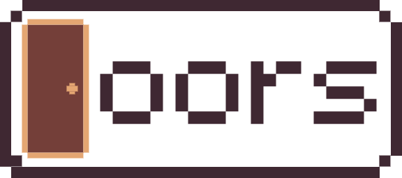

# Doors

A door guessing game made in just under 3 hours for the [Trijam #189](https://itch.io/jam/trijam-189).

For more information, check out the [Itch](https://iwoithe.itch.io/doors) page.

## Credits

- "[Chest Slam](https://pixabay.com/sound-effects/chest-slam-85122)" - by TNTdude7

- "[Wooden chair, push in, pull out](https://freesound.org/people/SpliceSound/sounds/218316)" - by SpliceSound, edited to use one sound only

- "[m5x7](https://managore.itch.io/m5x7)" - by Daniel Linssen

## License

Doors is released under the GNU General Public License v3.
